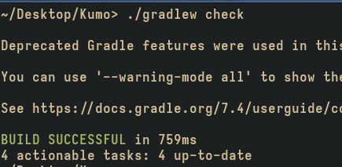
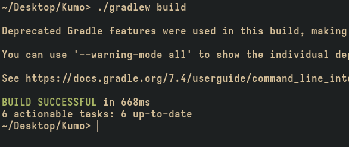
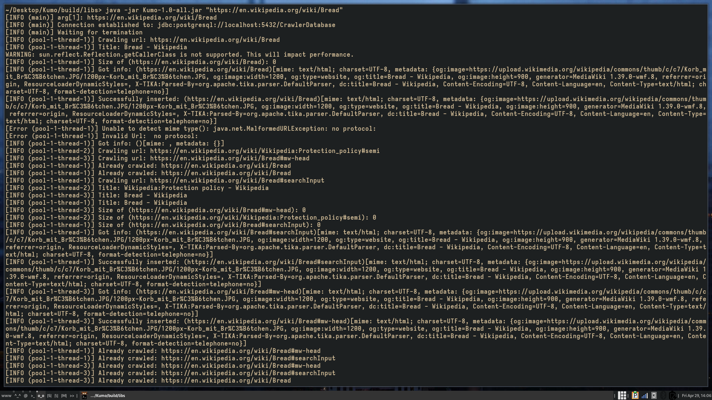

# Kumo

A web crawl crawly crawler spider that crawls the webpages for you.

## Installation

**>> Before installing make sure you have `postgresql` installed and configured
for your system.**

Start by cloning the repo

`git clone https://github.com/enziaki/Kumo`

Now `cd` into the cloned directory

`cd Kumo` 

## Building

we can start by checking the dependencies and requirements for the project. To
check for the correct configuration on the system run

`./gradlew check`

If the script says **Successful** then you are ready to start with building the
program.

Enter the command below to build the program

`./gradlew build`

After the building is done we can start by creating the database

## Database

Make sure postgresql is configured and installed correctly on your system. The
instruction for so are here:
[Linux](https://wiki.archlinux.org/title/PostgreSQL),
[Windows](https://www.postgresql.org/download/windows/),
[MacOS](https://www.postgresql.org/download/macosx/).

After postgresql has finished installing and the **users are already setup**,
it is time to create the database for our spidey Kumo.

Enter this in the postgresql_shell:

`createdb CrawlerDatabase`

## Running

After you have successfully created the database and you have checked for all required dependencies, it is time to finally run the program.

Go to the built program jar file

`cd build/libs`

Then to finally run the program

`java -jar Kumo-1.0-all.jar "https://your.url.here"`

### Output

Output is displayed in the terminal window while the option to download
directly from the postgresql server as a csv file is coming soon.

Here is what the output will look like:
